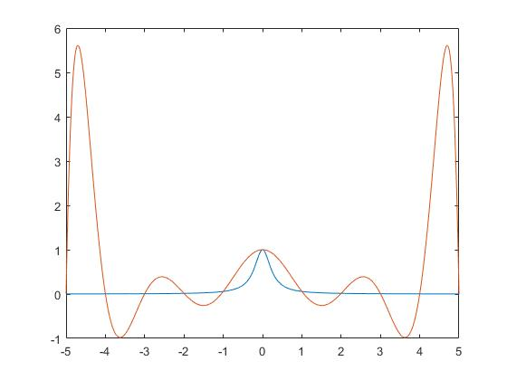
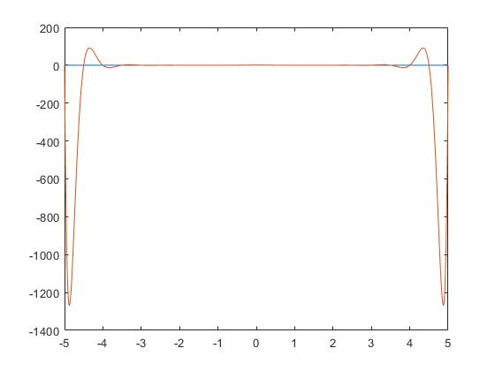
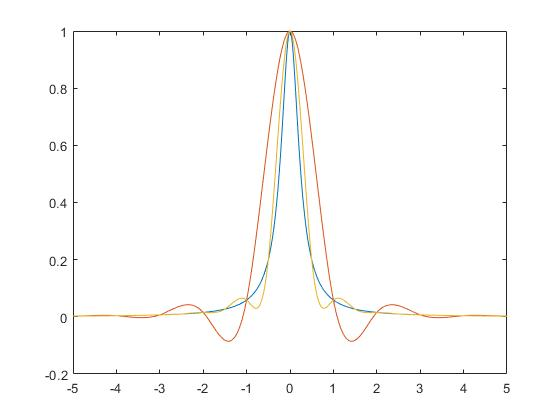

# 数值分析实验报告

计54 马子轩 2015012283

## 实验内容

### 实验A

已知 ，$ln{2} = 1 - \frac{1}{2} + \frac{1}{3} - \frac{1}{4} + \dots + \frac{(-1)^{k-1}}{k} + \dots$令$x_n = \sum_{k = 1}^{n}{\frac{(-1)^{k - 1}}{k}}$，$x_n$构成逼近$ln2$的数列，根据交错级数和截断误差的知识，有估计式$|x_n - ln2| < \frac{1}{n + 1}$。记$|x_n - ln2| < \epsilon$，若取$\epsilon = \frac{1}{2} \times 10^{-4}$， 试用单精度float计算$x_n$，问n取何值能满足精度需求，理论上n与实际n是否不同，为什么。令$ln2$的准确值为0.693147190546。

### 实验B

对$[-5, 5]$做等距划分$x_i = -5 + ih, h = 10/n, i = 0, 1, \dots, n$， 并对Runge给出的函数$f(x) = \frac{1}{1 + 16x^2}$，做Lagrange插值和三次样条插值，观察Runge现象并思考改进策略。

1. 分别取$n = 10, 20$做Lagrange代数插值。


2. 分别取$n = 10, 20$做一阶边界条件的三次样条插值。
3. 给出以上插值函数的图像，观察其不同。
4. 考察以上函数在$x = 4.8$时的误差，并分析思考。


## 实验过程

### 实验A

理论估计值为$n = \frac{1}{\epsilon} = 50000$

通过简单的模拟过程

```cpp
#include <cstdio>

const float ln2 = 0.693147190546;

float abs(float x) {
	return (x > 0) ? x : -x;
}

int main() {
	int n;
	float eps = 0.00005, x = 0.0;
	for (n = 1; abs(x - ln2) > eps; x += (n & 1) ? 1.0 / n : -1.0 / n, n++);
	printf("%d %.8f\n", n, x);
}
```

实际计算值为$n = 8976$

原因是因为单精度float本身精度就较低，有误差，所以达到精度要求快，更多原因是舍入时候恰好进入了范围。

### 实验B

针对Lagrange插值部分

直接根据定义编写

```cpp
double l0(double x) {
	double ans = 0, t = 1;
	for (int i = 0; i <= n0; i++) {
		t = 1;
		for (int j = 0; j <= n0; j++) {
			if (i != j) {
				t = t * (x - x0[j])/(x0[i] - x0[j]);
			}
		}
		ans = ans + t * y0[i];
	}
	return ans;
}

double l1(double x) {
	double ans = 0, t = 1;
	for (int i = 0; i <= n1; i++) {
		t = 1;
		for (int j = 0; j <= n1; j++) {
			if (i != j) {
				t = t * (x - x1[j])/(x1[i] - x1[j]);
			}
		}
		ans = ans + t * y1[i];
	}
	return ans;
}
```

```matlab
function y = langint(X, Y, x)
    l = size(X, 2);
    y = 0.0;
    for i = 1 : l
        t = 1.0;
        for j = 1 : l
            if i ~= j
                t = t .* (x - X(j)) ./ (X(i) - X(j));
            end
        end
        y = y + t .* Y(i);
    end
end
```

$f(4.8) = 0.0027$，但是在11点插值的时候，$f(4.8) = 5.1513$，21点插值的时候，$f(4.8) = -1080.7$。实验显示了Lagrange插值的不稳定性。

对这两种插值方式，分别做出图像。可以更加清晰的看出他们的不稳定性，尤其在高阶情况下更加糟糕。




针对三次样条插值部分

三次样条插值的代码主要分为两部分，矩阵构造和高斯消元

以10点插值为例，矩阵构造部分如下。实际构造为n段中，每段两个端点条件(2n个条件)，一次导数连续(n-1个条件)。二次导数连续(n-1个条件)。共4n-2个条件。配合一阶边界条件2个，共4n个方程。

```cpp
	memset(a, 0, sizeof(a));
	memset(b, 0, sizeof(b));
	memset(c, 0, sizeof(c));
	memset(d, 0, sizeof(d));
	memset(e, 0, sizeof(e));
	int cnt = 0;
	for (int i = 0; i < n0; i++) {
		a[cnt][i * 4] = 1;
		a[cnt][i * 4 + 1] = x0[i];
		a[cnt][i * 4 + 2] = x0[i] * x0[i];
		a[cnt][i * 4 + 3] = x0[i] * x0[i] * x0[i];
		b[cnt] = y0[i];
		cnt++;
		a[cnt][i * 4] = 1;
		a[cnt][i * 4 + 1] = x0[i + 1];
		a[cnt][i * 4 + 2] = x0[i + 1] * x0[i + 1];
		a[cnt][i * 4 + 3] = x0[i + 1] * x0[i + 1] * x0[i + 1];
		b[cnt] = y0[i + 1];
		cnt++;
	}
	for (int i = 1; i < n0; i++) {
		a[cnt][i * 4 + 1] = 1;
		a[cnt][i * 4 + 2] = 2 * x0[i];
		a[cnt][i * 4 + 3] = 3 * x0[i] * x0[i];
		a[cnt][i * 4 - 3] = -1;
		a[cnt][i * 4 - 2] = -2 * x0[i];
		a[cnt][i * 4 - 1] = -3 * x0[i] * x0[i];
		cnt++;
	}
	for (int i = 1; i < n0; i++) {
		a[cnt][i * 4 + 2] = 2;
		a[cnt][i * 4 + 3] = 6 * x0[i];
		a[cnt][i * 4 - 2] = -2;
		a[cnt][i * 4 - 1] = -6 * x0[i];
		cnt++;
	}
	a[cnt][1] = 1;
	a[cnt][2] = 2 * x0[0];
	a[cnt][3] = 3 * x0[0] * x0[0];
	b[cnt] = 0.000995;
	cnt++;
	a[cnt][4 * n0 - 3] = 1;
	a[cnt][4 * n0 - 2] = 2 * x0[n0];
	a[cnt][4 * n0 - 1] = 3 * x0[n0] * x0[n0];
	b[cnt] = -0.000995;
	cnt++;

	FILE *f = fopen("s0.txt", "w");
	bool err = gauss(40);
	for (int i = 0; i < n0; i++) {
		for (int j = 0; j < 4; j++) {
			s0[i][j] = e[i * 4 + j];
			fprintf(f, "%f ", s0[i][j]);
		}
		fprintf(f, "\n");
	}
	fclose(f);
```

```matlab
function s = slint(X, Y)
    l = size(X, 2) - 1;
    cnt = 1;
    a = zeros(4 * l, 4 * l);
    b = zeros(4 * l);
	for i = 1 : l
        a(cnt, i * 4 - 3) = 1;
        a(cnt, i * 4 - 2) = X(i);
        a(cnt, i * 4 - 1) = X(i) * X(i);
        a(cnt, i * 4) = X(i) * X(i) * X(i);
        b(cnt) = Y(i);
        cnt = cnt + 1;
        a(cnt, i * 4 - 3) = 1;
        a(cnt, i * 4 - 2) = X(i + 1);
        a(cnt, i * 4 - 1) = X(i + 1) * X(i + 1);
        a(cnt, i * 4) = X(i + 1) * X(i + 1) * X(i + 1);
        b(cnt) = Y(i + 1);
        cnt = cnt + 1;
    end
	for i = 2 : l
		a(cnt, i * 4 - 2) = 1;
		a(cnt, i * 4 - 1) = 2 * X(i);
		a(cnt, i * 4) = 3 * X(i) * X(i);
		a(cnt, i * 4 - 6) = -1;
		a(cnt, i * 4 - 5) = -2 * X(i);
		a(cnt, i * 4 - 4) = -3 * X(i) * X(i);
		cnt = cnt + 1;
    end
    for i = 2 : l
		a(cnt, i * 4 - 1) = 2;
		a(cnt, i * 4) = 6 * X(i);
		a(cnt, i * 4 - 5) = -2;
		a(cnt, i * 4 - 4) = -6 * X(i);
		cnt = cnt + 1;
    end
	a(cnt, 2) = 1;
	a(cnt, 3) = 2 * X(1);
	a(cnt, 4) = 3 * X(1) * X(1);
	b(cnt) = 0.000995;
	cnt = cnt + 1;
	a(cnt, 4 * l - 2) = 1;
	a(cnt, 4 * l - 1) = 2 * X(l + 1);
	a(cnt, 4 * l) = 3 * X(l + 1) * X(l + 1);
	b(cnt) = -0.000995;
    c = inv(a) * b;
    s = zeros(l, 4);
    for i = 1 : l
        for j = 1 : 4
            s(i, j) = c((i - 1) * 4 + j);
        end
    end
end
```

高斯消元部分，每次选取当前列绝对值最大的式子，消去其他所有式子。

```cpp
bool gauss(int n) {
	int p;
	double t, max;
	for (int i = 0; i < n; i++) {
		p = -1;
		max = 0;
		for (int j = 0; j < n; j++) {
			if (!c[j] && abs(a[j][i]) > max) {
				p = j;
				max = abs(a[j][i]);
			}
		}
		if (p == -1) return 1;
		t = a[p][i];
		for (int j = 0; j < n; j++) {
			a[p][j] /= t;
		}
		b[p] /= t;
		c[p] = 1;
		d[i] = p;
		for (int j = 0; j < n; j++) {
			if (p != j) {
				t = a[j][i];
				for (int k = 0; k < n; k++) {
					a[j][k] -= t * a[p][k];
				}
				b[j] -= t * b[p];
			}
		}
	}
	for (int i = 0; i < n; i++) {
		e[i] = b[d[i]] / a[d[i]][i];
	}
	return 0;
}
```

这时针对得出的n个3次方程，绘制图像



可以看出，随着分段个数的增加，拟合程度也提高了。

$f(4.8) = 0.0027$，但是在10段插值的时候，$f(4.8) = 0.0012$，20段插值的时候，$f(4.8) = 0.0043$。误差均较低。

因此，三次样条插值能够很好的还原原函数的表现，同时随着分段段数的增加，表现更好。


## 实验组织

A.cpp 实验A的代码

B.cpp 实验B的代码

B1.m 实验B,Lagrange部分的绘图代码

B2.m 实验B,三次样条部分的绘图代码

langint.m 实验B,Lagrange插值的代码

slint.m 实验B,三次样条部分的代码

s*.txt 实验中间结果，用于c++和matlab之间数据的传输

*.jpg 报告中的图片


测试过程：

1. 实验A: 编译运行A.cpp即可.
2. 实验B: 编译运行B.cpp，分别运行B1.m, B2.m.


## 实验总结

在这个实验之后，我更清晰的理解了误差与插值法。特别是Runge现象，原本只是有个概念，通过实验我能清晰的看到他的结果。另外，在调试三次样条插值代码的时候，我初始值给错了，然后检查构造矩阵和高斯消元检查了很久，没看懂为什么错了，不应该的，后续实验应该注意。