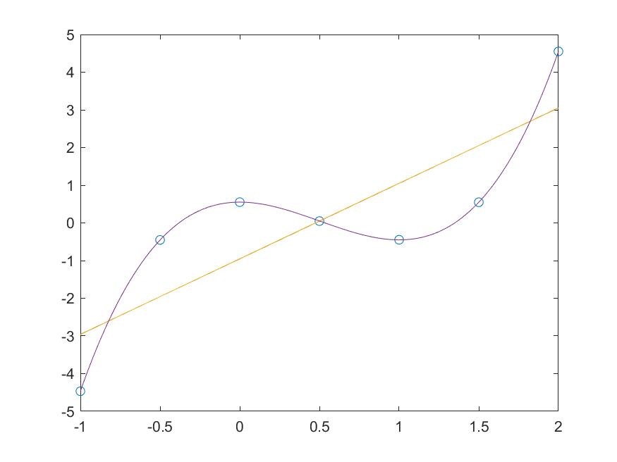

# 数值分析实验报告

计54 马子轩 2015012283

## 实验内容

从随机的数据中找出其规律性，给出其近似表达式的问题，在生产实践和科学实验中大量存在，通常利用数据的最小二乘法求得拟合曲线。

用最小二乘法求一个多项式，使得它与下列数据相拟合。

|x|-1.0|-0.5|0.0|0.5|1.0|1.5|2.0|
|-|-|-|-|-|-|-|-|
|y|-4.467|-0.452|0.551|0.048|-0.447|0.549|4.552|

## 实验过程

直接根据公式计算即可。

其中x为x^0,x^1,...,x^dim，dim最高次数。z为拟合多项式结果，从0次到dim次

```cpp
void calc(vector <double> &z, vector <vector <double>> &x, vector <double> &y, int dim) {
	vector <vector <double>> ma;
	vector <double> vb;
	double tmp;

	z.clear();
	for (int i = 0; i <= dim; i++) {
		ma.emplace_back(0);
		for (int j = 0; j <= dim; j++) {
			spot(tmp, x[i], x[j]);
			ma[i].emplace_back(tmp);
		}
	}

	for (int i = 0; i <= dim; i++) {
		spot(tmp, x[i], y);
		vb.emplace_back(tmp);
	}

	gauss(z, ma, vb);
}
```

运行结果

```shell
-0.95446 2.00436
-0.95164 2.00812 -0.00376
0.55102 0.00456 -3.00910 2.00356
```

拟合过程

```matlab
x = [-1.0, -0.5, 0.0, 0.5, 1.0, 1.5, 2.0];
y = [-4.467, -0.452, 0.551, 0.048, -0.447, 0.549, 4.552];

p1 = [2.00436, -0.95446]
p2 = [-0.00376, 2.00812, -0.95164]
p3 = [2.00356, -3.00910, 0.00456, 0.55102]

plot(x, y, 'o');

hold on;

tx = [-1.0 : 0.01 : 2.0];

plot(tx, polyval(p1, tx));
hold on;
plot(tx, polyval(p2, tx));
hold on;
plot(tx, polyval(p3, tx));

saveas(gcf, 'plot.jpg', 'jpg');
```



## 实验组织

main.cpp 计算代码

gauss.h 高斯消元的头文件

gauss.cpp 高斯消元的代码


测试过程：

g++ main.cpp gauss.cpp --std=c++11

## 实验总结

在这个实验之后，我更加理解了最小二乘法的实现原理和实际使用效果。对该算法有了更深的理解。
